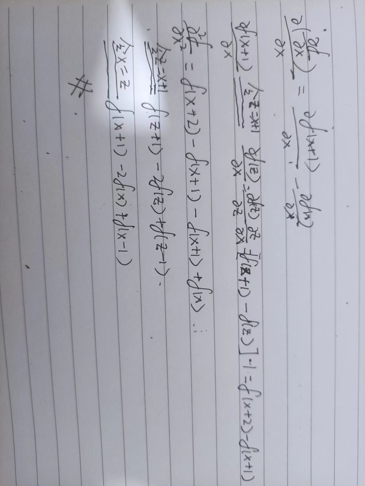

# Digital Image Processing

*This Book is property of the Half-Blood Prince*:)

关于冈萨雷斯《数字图像处理》第四版的代码实现。第一章使用python，第一章之后内部算法使用python实现，运行使用ipynb。

## 第三章 灰度变换和空间滤波
[3.3直方图处理](.\灰度变换与空间滤波\hist_demo.py)

### 公式 3.49 推导

[3.4-3.6空间滤波](.\灰度变换与空间滤波\filter_demo.py)

## 第四章 频率域滤波

[4.1-4.4傅里叶变化](./频率域滤波/fft.md)

[4.6 傅里叶频谱](./频率域滤波/FFT.ipynb)

[4.7频率域滤波](./频率域滤波/FFT.ipynb)

## 第五章 图像复原与重建

[5.2噪声模型](./图像复原与重建/IR.ipynb)

[5.3空间滤波](./图像复原与重建/IR.ipynb)

[5.2频率域滤波](./图像复原与重建/IR.ipynb)

*估计退化函数属于盲去卷积，不在这里实现*

## 第六章 彩色图像处理

[6.2彩色模型](./彩色图像处理/CIP.ipynb)

[6.6彩色图像平滑和锐化](./彩色图像处理/CIP.ipynb)

*其余内容在剩下的对应章节实现*
## 第八章 图像压缩和水印

[8.8比特平面编码](./图片压缩和水印/imagecompression.ipynb)

## 第九章 形态学图像处理

[9.2腐蚀和膨胀](./形态学图像处理/MorphologicalImageProcessing.ipynb)

[9.3开运算与闭运算](./形态学图像处理/MorphologicalImageProcessing.ipynb)

[9.5基本的形态学算法](./形态学图像处理/MorphologicalImageProcessing.ipynb)

## 第十章  图像分割

[10.2点线边缘检测](./图像分割/imagesegmentation.ipynb)

[10.3阈值处理](./图像分割/imagesegmentation.ipynb)

