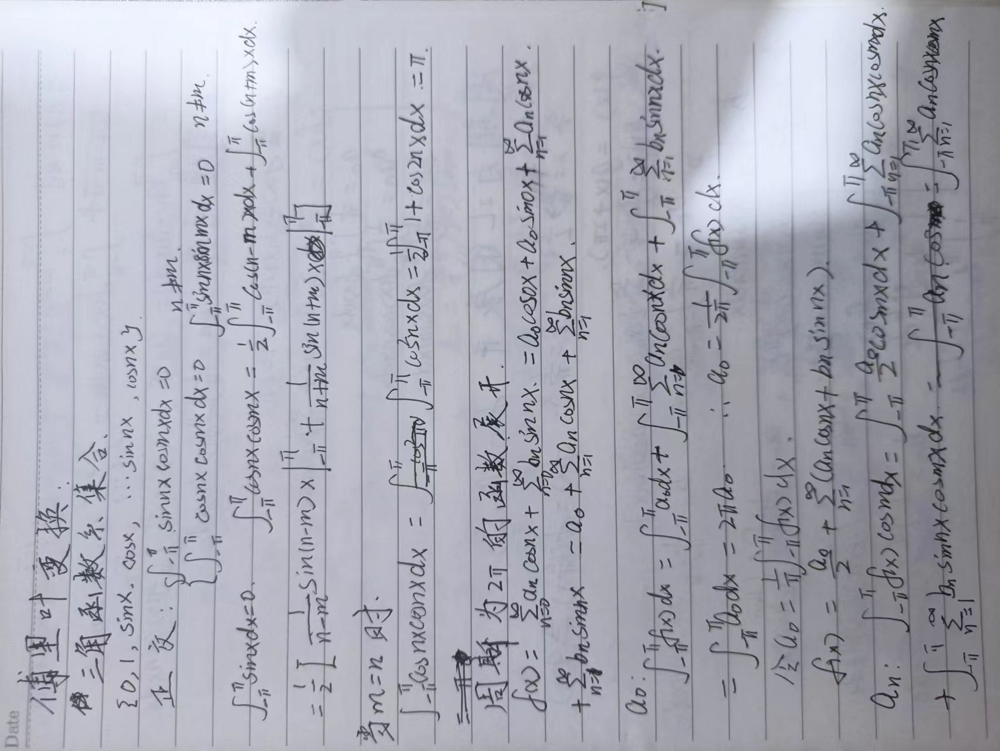
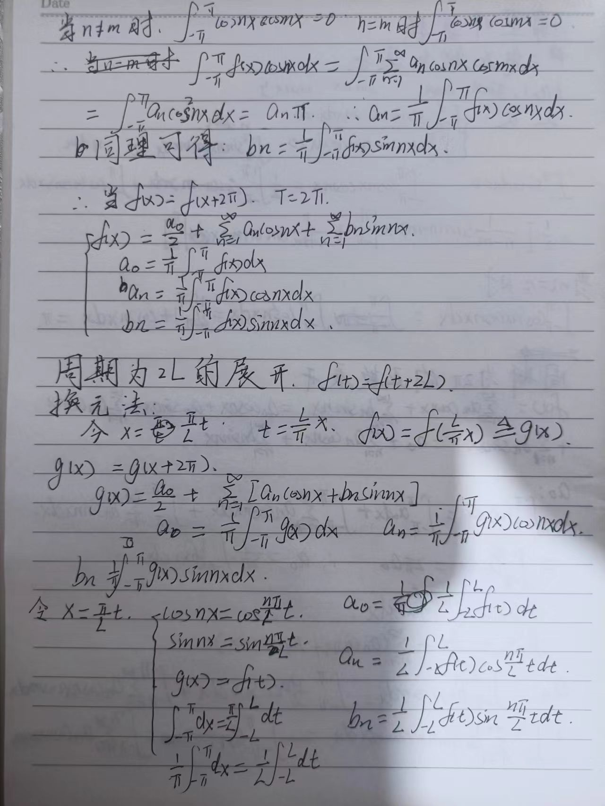
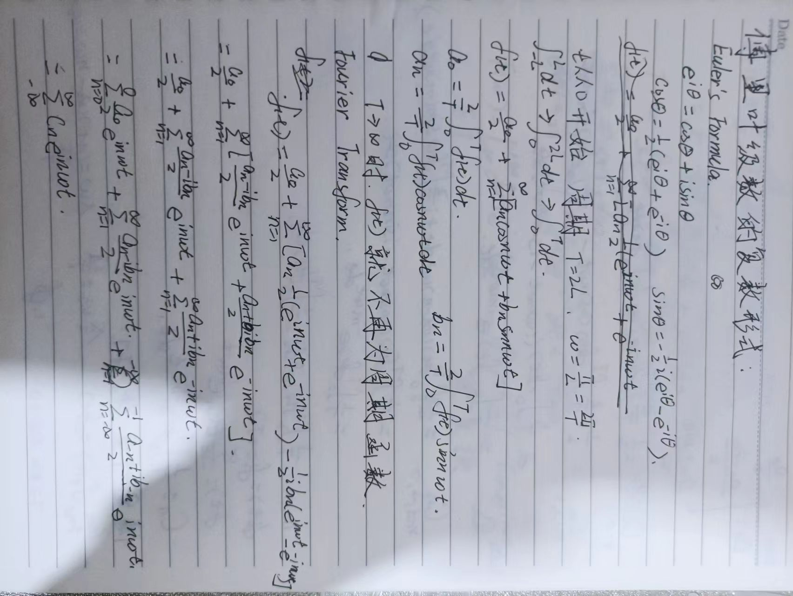
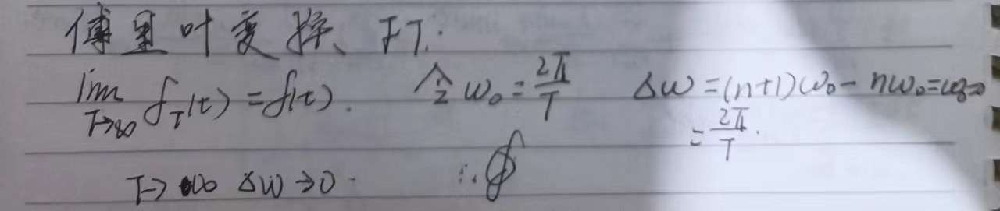
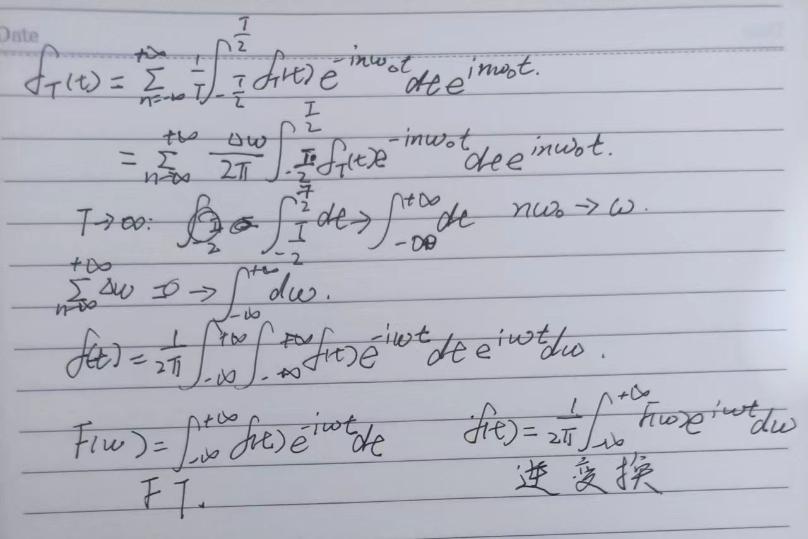

# Digital Image Processing

*This Book is property of the Half-Blood Prince*:)

关于冈萨雷斯《数字图像处理》的代码实现

## 第三章 灰度变换和空间滤波
[3.3直方图处理](.\灰度变换与空间滤波\hist_demo.py)

### 公式 3.49 推导

[3.4-3.6空间滤波](.\灰度变换与空间滤波\filter_demo.py)

## 第四章 频率域滤波

[4.1-4.4傅里叶变化]()

*Fourier Tormula* 推导

周期为$2\pi$的函数傅里叶展开

周期为$2L$的展开

复试形式

傅里叶变换

